# Global Health Dataset — Data Cleaning & Validation Pipeline


A modular Python-based data cleaning, transformation, validation, and export pipeline for the **Global Health Dataset (2000–2024)**.

This project focuses on transforming a raw, inconsistent health dataset into a structured, validated, analysis-ready dataset through a reproducible data preparation workflow.

> **Current checkpoint:** Raw data ingestion, auditing, cleaning, missing-value handling, transformation, validation, validation reporting, and cleaned-data export have been implemented.
> **Machine learning, visualization, dashboard development, and advanced analytics are planned for subsequent stages and are not yet part of this checkpoint.**

---

## Table of Contents

* [Project Overview](#project-overview)
* [Project Objectives](#project-objectives)
* [Current Project Status](#current-project-status)
* [Dataset Overview](#dataset-overview)
* [Data Preparation Workflow](#data-preparation-workflow)

  * [1. Data Extraction](#1-data-extraction)
  * [2. Initial Data Audit](#2-initial-data-audit)
  * [3. Text Cleaning](#3-text-cleaning)
  * [4. Numeric Cleaning](#4-numeric-cleaning)
  * [5. Missing-Value Handling](#5-missing-value-handling)
  * [6. Data Transformation](#6-data-transformation)
  * [7. Data Validation](#7-data-validation)
  * [8. Validation Reporting](#8-validation-reporting)
  * [9. Cleaned Data Export](#9-cleaned-data-export)
* [Project Architecture](#project-architecture)
* [Directory Structure](#directory-structure)
* [Core Modules](#core-modules)
* [Data Quality Challenges](#data-quality-challenges)
* [Data Cleaning Strategy](#data-cleaning-strategy)
* [Validation Strategy](#validation-strategy)
* [Output Files](#output-files)
* [Technology Stack](#technology-stack)
* [How to Run the Pipeline](#how-to-run-the-pipeline)
* [Pipeline Execution Flow](#pipeline-execution-flow)
* [Reproducibility](#reproducibility)
* [Current Limitations](#current-limitations)
* [Future Development](#future-development)
* [Project Status](#project-status)
* [Author](#author)

---

## Project Overview

The **Global Health Dataset — Data Cleaning & Validation Pipeline** is a data engineering and preparation project built around a global health dataset covering multiple countries, diseases, health indicators, and years.

The raw dataset contains inconsistencies that make direct analysis unreliable. These include:

* Inconsistent country names
* Inconsistent disease names
* Numeric values stored as text
* Missing values
* Inconsistent categorical values
* Potentially invalid or extreme observations
* Formatting inconsistencies
* Structural missingness across specific disease/indicator combinations
* Data-type inconsistencies across columns

The purpose of this project is to create a **reliable, structured, and validated dataset that can serve as the foundation for downstream analysis**.

Rather than performing all analysis in a single script, the project uses a modular architecture where different stages of the data preparation process are handled by dedicated Python modules.

---

## Project Objectives

The main objectives of this stage of the project are to:

1. Load and inspect the raw Global Health Dataset.
2. Perform an initial audit of the dataset.
3. Identify structural and data-quality issues.
4. Standardize text and categorical fields.
5. Convert numeric columns into appropriate numerical data types.
6. Identify and handle missing values.
7. Apply appropriate data transformations and derived fields.
8. Detect and address problematic values and outliers where appropriate.
9. Validate the resulting dataset.
10. Generate a validation report.
11. Export the cleaned dataset for downstream analysis.

The primary goal is **data quality and analytical readiness**, not yet predictive modeling or dashboard development.

---

# Current Project Status

### Completed

* [x] Raw dataset ingestion
* [x] Initial dataset inspection
* [x] Data auditing
* [x] Country-name standardization
* [x] Disease-name standardization
* [x] Text cleaning
* [x] Numeric data cleaning
* [x] Data-type conversion
* [x] Missing-value investigation
* [x] Missing-value handling
* [x] Data transformations
* [x] Derived-column preparation
* [x] Outlier handling where appropriate
* [x] Data validation
* [x] Validation reporting
* [x] Cleaned dataset export
* [x] Validation report export

### Not Yet Completed

* [ ] Exploratory Data Analysis
* [ ] Statistical analysis
* [ ] Advanced visualization
* [ ] Power BI dashboard
* [ ] Machine learning models
* [ ] Predictive analytics
* [ ] Automated analytical reporting
* [ ] Deployment

These items belong to subsequent stages of the project.

---

# Dataset Overview

The project uses the **Global Health Dataset (2000–2024)**.

The dataset contains health-related observations covering:

* Multiple countries
* Multiple diseases
* Multiple years
* Health indicators
* Mortality-related measures
* Incidence and prevalence indicators
* Healthcare access indicators
* Healthcare resource indicators
* Treatment-related variables
* Other global health metrics

### Dataset Scope

| Attribute                   | Description                     |
| --------------------------- | ------------------------------- |
| Dataset                     | Global Health Dataset           |
| Period                      | 2000–2024                       |
| Geographic Coverage         | Multiple countries              |
| Disease Coverage            | Multiple diseases               |
| Format                      | CSV                             |
| Primary Processing Language | Python                          |
| Main Data Tool              | Pandas                          |
| Output                      | Cleaned CSV + Validation Report |

### Countries Represented

The dataset includes countries such as:

* Argentina
* Australia
* Brazil
* Canada
* China
* France
* Germany
* India
* Indonesia
* Italy
* Japan
* Mexico
* Nigeria
* Russia
* Saudi Arabia
* South Africa
* South Korea
* Turkey
* United Kingdom
* United States

### Raw Dataset


---

# Data Preparation Workflow

The current implementation follows a modular ETL-style data preparation process:

```text
Raw Dataset
     │
     ▼
Data Extraction
     │
     ▼
Initial Audit
     │
     ▼
Text Cleaning
     │
     ▼
Numeric Cleaning
     │
     ▼
Missing-Value Handling
     │
     ▼
Transformation
     │
     ▼
Validation
     │
     ▼
Validation Report
     │
     ▼
Cleaned Dataset Export
```

Each stage has a specific responsibility.

## 1. Data Extraction

The extraction stage is responsible for loading the raw dataset into the processing workflow.

The pipeline is designed to work with the raw CSV files stored under:

```text
data/raw/
```

Current raw files include:

```text
Global Health Dataset.csv
Global Health Dataset - Copy.csv
```

The extraction module provides a controlled entry point for bringing raw data into the pipeline before cleaning begins.

## 2. Initial Data Audit

Before modifying the data, the project performs an initial audit to understand the structure and quality of the raw dataset.

The audit process examines areas such as:

* Number of rows
* Number of columns
* Column names
* Data types
* Missing values
* Unique values
* Duplicate records
* Categorical consistency
* Numerical fields
* Potential anomalies

This step is important because cleaning decisions should be based on the actual condition of the dataset rather than assumptions.

The auditing utilities are located in:

```text
src/utils/audit.py
```

## 3. Text Cleaning

The text-cleaning stage standardizes textual and categorical fields.

Examples include:

### Country Names

Country names are normalized so that different representations of the same country are mapped to a consistent value.

For example, variations in country naming can be standardized into one canonical representation.

### Disease Names

Disease names are also normalized to prevent inconsistent categorical values from being treated as separate diseases during analysis.

### General Text Standardization

The cleaning process may include:

* Removing unnecessary whitespace
* Standardizing capitalization
* Normalizing categorical labels
* Replacing inconsistent naming patterns
* Cleaning textual artifacts

The implementation is contained in:

```text
src/text_cleaning.py
```

## 4. Numeric Cleaning

The raw dataset contains numerical information that may initially be represented as strings or contain formatting issues.

The numeric-cleaning stage converts applicable columns into appropriate numerical data types.

This stage addresses issues such as:

* Numeric values stored as strings
* Non-numeric characters
* Formatting inconsistencies
* Invalid numeric representations
* Conversion failures
* Numerical ranges requiring inspection

The implementation is contained in:

```text
src/numeric_cleaning.py
```

The objective is to ensure that numerical columns can be reliably used for:

* Calculations
* Aggregation
* Statistical analysis
* Visualization
* Future modeling

## 5. Missing-Value Handling

Missing values were identified as one of the major data-quality challenges in the raw dataset.

The project does not simply replace every missing value with a generic statistic.

Instead, missingness is investigated to determine whether it represents:

* Random missing data
* Structural missingness
* Indicator-specific missingness
* Disease-specific missingness
* Country-specific missingness
* Data collection limitations

For example, some health indicators have systematic missing values for particular diseases rather than random missing observations.

The missing-value processing is implemented in:

```text
src/missing_values.py
```

The goal is to preserve meaningful information while preventing inappropriate imputation from introducing misleading data.

## 6. Data Transformation

After cleaning the individual fields, the pipeline performs additional transformations required to produce an analysis-ready dataset.

Transformations may include:

* Creating derived fields
* Standardizing representations
* Preparing analytical columns
* Applying appropriate data types
* Handling values identified during the cleaning stages
* Structuring the final dataset for downstream analysis

The transformation process is coordinated through the pipeline module:

```text
src/pipeline.py
```

The pipeline brings the individual cleaning components together into a reproducible workflow.

## 7. Data Validation

Cleaning a dataset does not automatically mean the resulting data is correct.

For this reason, validation is performed after the cleaning and transformation stages.

The validation process checks whether the resulting dataset satisfies expected quality conditions.

Examples include:

* Required columns are present
* Expected data types are maintained
* Missing values are within acceptable conditions
* Country values are standardized
* Disease values are standardized
* Numeric columns contain valid numerical data
* Invalid records are identified
* Dataset structure remains consistent
* Potential duplicate records are examined
* Data ranges are inspected

The validation implementation is located in:

```text
src/validation.py
```

## 8. Validation Reporting

The validation stage is accompanied by a validation-report generation process.

The purpose of the report is to provide a structured summary of the quality checks performed on the processed dataset.

The validation reporting module is:

```text
src/validation_report.py
```

The resulting report is stored under:

```text
data/processed/
```

Current output:

```text
validation_report.csv
```

This provides an auditable record of the validation results rather than relying only on visual inspection.

## 9. Cleaned Data Export

Once the dataset passes through the cleaning, transformation, and validation stages, the processed dataset is exported for downstream use.

The cleaned dataset is currently stored as:

```text
data/processed/Global Health Dataset_cleaned.csv
```

The export functionality is handled through:

```text
src/export.py
```

The project also contains export functionality within the broader application architecture for formats such as:

* CSV
* Excel
* SQLite
* JSON

However, the current project checkpoint primarily focuses on producing and preserving the validated cleaned dataset.

# Project Architecture

The project follows a modular data-processing architecture rather than placing all operations inside a single Python script.

The architecture can be summarized as:

```text
                    ┌─────────────────────┐
                    │    Raw CSV Data     │
                    │      data/raw       │
                    └──────────┬──────────┘
                               │
                               ▼
                    ┌─────────────────────┐
                    │   Data Extraction   │
                    │    extract.py       │
                    └──────────┬──────────┘
                               │
                               ▼
                    ┌─────────────────────┐
                    │     Data Audit      │
                    │     audit.py        │
                    └──────────┬──────────┘
                               │
                               ▼
                    ┌─────────────────────┐
                    │    Text Cleaning    │
                    │ text_cleaning.py    │
                    └──────────┬──────────┘
                               │
                               ▼
                    ┌─────────────────────┐
                    │   Numeric Cleaning  │
                    │ numeric_cleaning.py │
                    └──────────┬──────────┘
                               │
                               ▼
                    ┌─────────────────────┐
                    │ Missing Value       │
                    │ Handling            │
                    │ missing_values.py   │
                    └──────────┬──────────┘
                               │
```

# Directory Structure

The repository is organized as follows:

```text
.
├── .history/
│   ├── src/
│   │   ├── config_*.py
│   │   ├── extract_*.py
│   │   ├── missing_values_*.py
│   │   ├── numeric_cleaning_*.py
│   │   ├── pipeline_*.py
│   │   ├── text_cleaning_*.py
│   │   ├── validation_*.py
│   │   ├── validation_report_*.py
│   │   ├── export_*.py
│   │   ├── main_*.py
│   │   ├── test_*.py
│   │   └── utils/
│   │       └── audit_*.py
│   └── utils/
│       └── audit_*.py
│
├── data/
│   ├── processed/
│   │   ├── Global Health Dataset_cleaned.csv
│   │   └── validation_report.csv
│   │
│   ├── raw/
│   │   ├── Global Health Dataset.csv
│   │   └── Global Health Dataset - Copy.csv
│   │
│   └── screenshots/
│       ├── config_module.png
│       ├── export_module.png
│       ├── extract_module.png
│       ├── Global Health Dataset cleaned_csv.png
│       ├── Global Health Dataset raw_csv.png
│       ├── main_module.png
│       ├── missing_values_module.png
│       ├── numeric_cleaning_module.png
│       ├── pipeline_module.png
│       ├── text_cleaning_module.png
│       ├── validation_module.png
│       ├── validation_report_csv.png
│       └── validation_report_module.png
│
├── database/
│
├── reports/
│
└── src/
    ├── config.py
    ├── export.py
    ├── extract.py
    ├── main.py
    ├── missing_values.py
    ├── numeric_cleaning.py
    ├── pipeline.py
    ├── test.py
    ├── text_cleaning.py
    ├── validation.py
    ├── validation_report.py
    │
    └── utils/
        ├── audit.py
        └── __init__.py
```

# Directory Responsibilities

| Directory         | Purpose                                                   |
| ----------------- | --------------------------------------------------------- |
| `data/raw/`       | Original/raw datasets                                     |
| `data/processed/` | Cleaned datasets and validation outputs                   |
| `database/`       | Reserved for database-related processing                  |
| `reports/`        | Reserved for future analytical/report outputs             |
| `src/`            | Main project source code                                  |
| `src/utils/`      | Reusable utility functions                                |
| `.history/`       | Development/history files generated during implementation |

The .history/ directory contains development snapshots and is not part of the core production pipeline.

# Core Modules

## config.py

Contains project-level configuration and settings used by the pipeline.

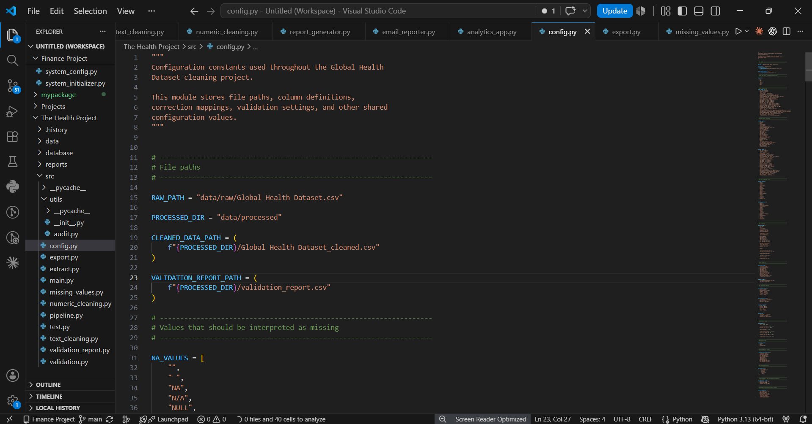

## extract.py

Responsible for loading the raw dataset into the processing workflow.

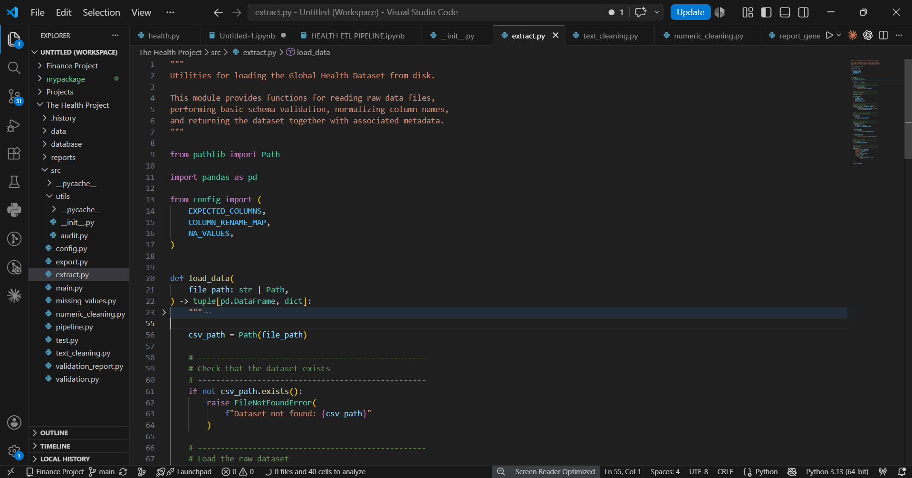

## text_cleaning.py

Handles textual and categorical standardization, including country and disease names.

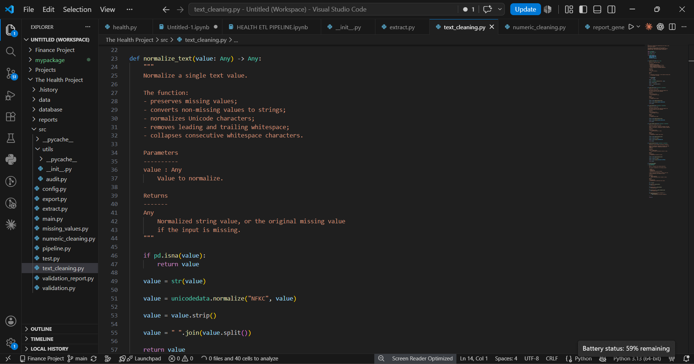

## numeric_cleaning.py

Handles conversion and cleaning of numerical columns.

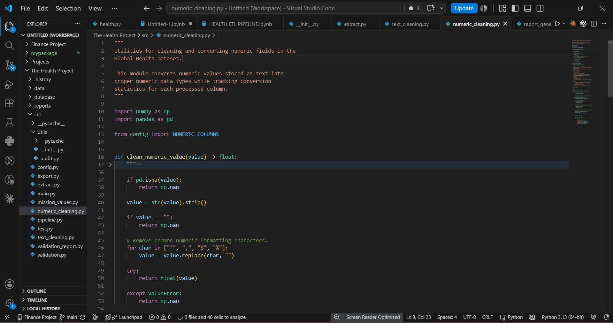

## missing_values.py

Investigates and handles missing values based on their characteristics and context.

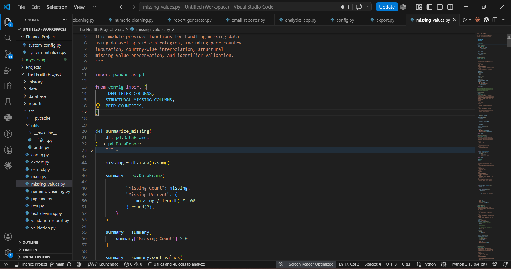

## pipeline.py

Coordinates the different cleaning and transformation stages into a reproducible workflow.

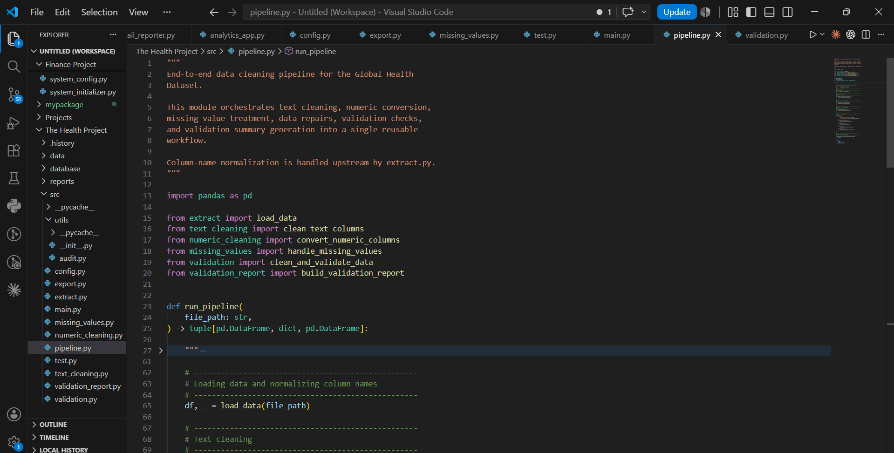

## validation.py

Performs post-cleaning data-quality checks.

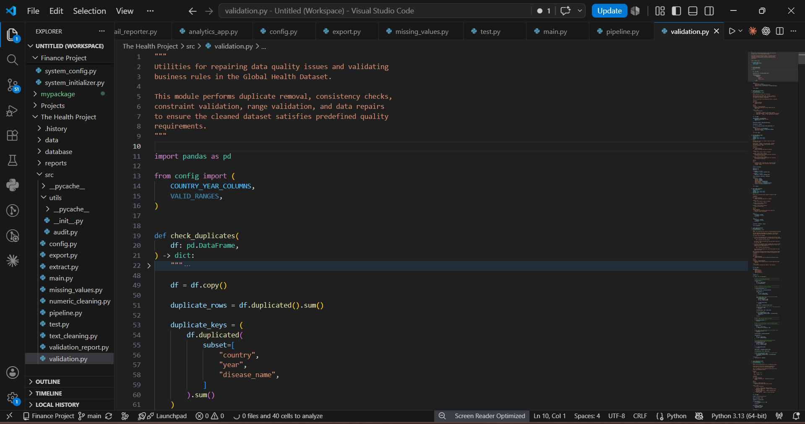

## validation_report.py

Generates a structured report summarizing validation results.

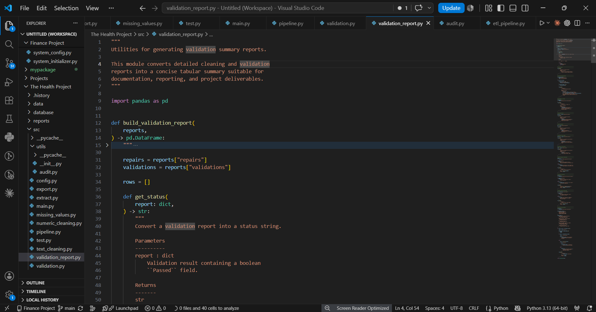

## export.py

Handles the export of processed data into supported formats.

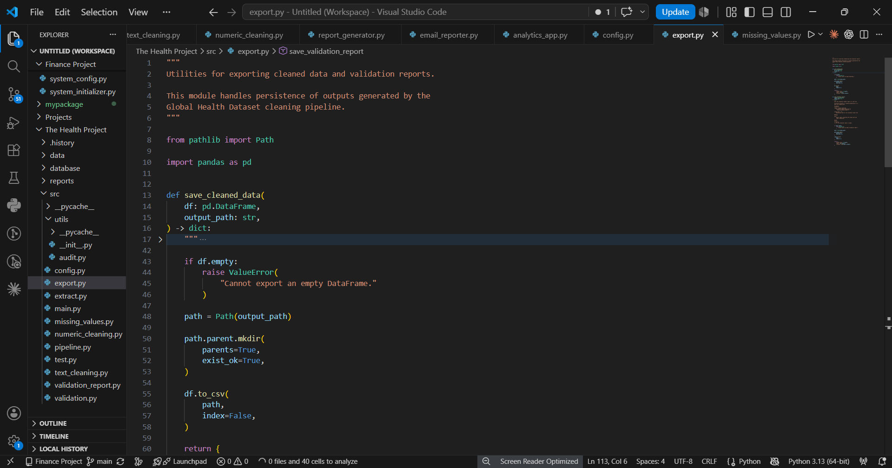

## utils/audit.py

Provides reusable auditing functionality for examining dataset structure and quality.

## main.py

Serves as the main execution entry point for the application/pipeline.

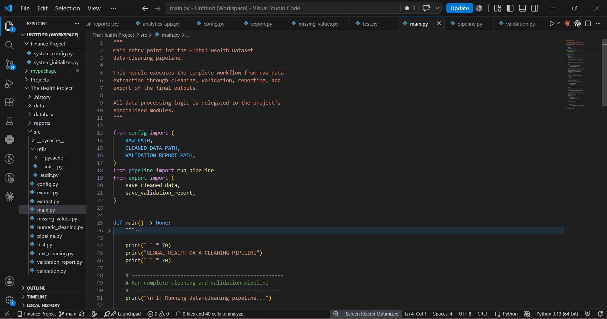

## test.py

Contains testing functionality used during development to verify components of the data-processing workflow.

# Data Quality Challenges

Several data-quality issues were encountered during the preparation of the dataset.

## 1. Inconsistent Data Types

A significant number of columns were initially represented as object rather than appropriate numerical or categorical data types.

This required explicit type conversion and numerical cleaning.

## 2. Missing Values

The initial audit identified missing values across the dataset.

Importantly, not all missing values represented the same problem.

Some missing values followed identifiable patterns associated with particular diseases, indicators, or countries.

Therefore, missingness had to be investigated before determining an appropriate treatment strategy.

## 3. Inconsistent Country Names

Country labels required standardization to ensure that the same country was not represented by multiple categorical values.

## 4. Inconsistent Disease Names

Disease labels also required normalization to ensure consistent grouping and analysis.

## 5. Structural Missingness

Some indicators contain systematic missing values for particular diseases.

For example, certain neurological diseases may not have incidence or prevalence values available in the same way as infectious diseases.

Such patterns should not automatically be treated as ordinary random missing values.

## 6. Potential Outliers

Numerical variables were inspected for extreme observations.

Where appropriate, outlier handling was incorporated into the cleaning workflow while avoiding indiscriminate removal of potentially meaningful observations.

# Data Cleaning Strategy

The project follows a principle of cleaning based on context rather than blindly modifying values.

The general strategy is:

```text
Identify
   ↓
Investigate
   ↓
Determine Cause
   ↓
Apply Appropriate Treatment
   ↓
Validate
```

This is particularly important for missing values and outliers.

For example, replacing every missing value with the mean could create artificial patterns and distort subsequent analysis.

The objective is therefore not simply to achieve a dataset with zero missing values, but to produce a dataset whose values and structure are appropriate for downstream analytical use.

# Validation Strategy

Validation occurs after the cleaning and transformation stages.

The project validates the processed dataset across several dimensions.

## Structural Validation

Checks that:

* Expected columns exist
* Dataset structure remains intact
* Records can be processed correctly

## Data-Type Validation

Checks that:

* Numerical columns contain numerical data
* Year is represented appropriately
* Categorical fields remain categorical/textual

## Missing-Value Validation

Checks:

* Remaining missing values
* Missing-value patterns
* Columns requiring further attention

## Categorical Validation

Checks:

* Country-name consistency
* Disease-name consistency
* Unexpected categorical values

## Numerical Validation

Checks:

* Invalid numerical values
* Unexpected ranges
* Potential anomalies
* Outlier-related conditions

The validation process creates a separate validation report so that data-quality decisions can be reviewed independently from the cleaned dataset.

# Output Files

The current processed outputs are stored in:

```text
data/processed/
```

## Cleaned Dataset

### Global Health Dataset_cleaned.csv

This is the primary output of the current data-preparation stage.

It represents the dataset after the implemented cleaning, transformation, and processing steps.


## Validation Report

### validation_report.csv

This contains the results of the validation process applied to the processed dataset.

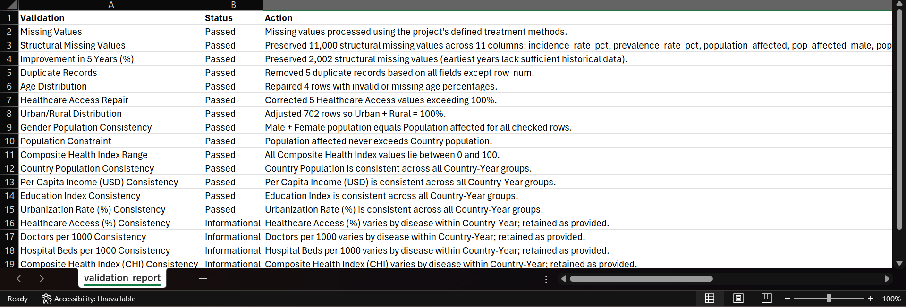

# Technology Stack

## Programming Language

Python 3.13

## Data Processing

* Pandas
* NumPy

## File Processing

* CSV
* Excel
* SQLite
* JSON

## Development

* Modular Python architecture
* Reusable functions
* Validation and testing modules

# How to Run the Pipeline

## 1. Clone the Repository

```bash
git clone <repository-url>
cd <repository-directory>
```

## 2. Install Dependencies

If a requirements file is provided:

```bash
pip install -r requirements.txt
```

Alternatively, install the primary data-processing libraries:

```bash
pip install pandas numpy
```

## 3. Place the Raw Dataset

Place the source CSV file inside:

```text
data/raw/
```

For example:

```text
data/raw/Global Health Dataset.csv
```

## 4. Run the Pipeline

From the project root:

```bash
python src/main.py
```

The exact execution behavior depends on the current configuration in src/config.py.

## 5. Review the Outputs

After processing, inspect:

```text
data/processed/Global Health Dataset_cleaned.csv
```

and:

```text
data/processed/validation_report.csv
```

These files represent the main deliverables of the current checkpoint.

# Pipeline Execution Flow

The conceptual execution sequence is:

```text
1. Load raw dataset
        ↓
2. Audit dataset
        ↓
3. Clean text fields
        ↓
4. Clean numeric fields
        ↓
5. Investigate missing values
        ↓
6. Handle missing values
        ↓
7. Apply transformations
        ↓
8. Validate processed data
        ↓
9. Generate validation report
        ↓
10. Export cleaned dataset
```

This structure makes it possible to modify or improve individual stages without rewriting the entire project.

# Reproducibility

One of the main goals of the project is to make the cleaning process reproducible.

Instead of manually editing the CSV file, the cleaning logic is implemented programmatically through dedicated Python modules.

This provides several advantages:

* The same cleaning process can be rerun.
* Cleaning decisions are documented in code.
* Individual stages can be tested independently.
* Data-quality checks can be repeated.
* Future changes can be incorporated into the pipeline.
* The resulting dataset can be regenerated from the raw source.

The .history/ directory contains development snapshots created during implementation and experimentation.

The primary reproducible workflow is maintained under:

```text
src/
```

# Current Limitations

This checkpoint intentionally focuses on data preparation.

The following capabilities are not yet implemented as completed project stages:

* Exploratory Data Analysis
* Statistical hypothesis testing
* Advanced analytical visualization
* Interactive dashboards
* Machine learning
* Predictive modeling
* Automated business/analytical reporting
* Production deployment

The cleaned dataset produced at this stage is intended to serve as the foundation for these future stages.

# Future Development

The project will evolve from data preparation into a broader global health analytics project.

Planned subsequent stages include:

## Phase 2 — Exploratory Data Analysis

* Univariate analysis
* Bivariate analysis
* Multivariate analysis
* Trend analysis
* Country comparisons
* Disease comparisons
* Correlation analysis
* Distribution analysis

## Phase 3 — Data Visualization

Development of meaningful visualizations to communicate health trends and relationships across:

* Countries
* Diseases
* Years
* Health indicators

## Phase 4 — Advanced Analytics

Potential analytical areas include:

* Statistical analysis
* Relationship analysis
* Health indicator comparisons
* Country-level health profiling
* Disease trend analysis

## Phase 5 — Machine Learning

Potential future modeling work may include:

* Mortality prediction
* Recovery-rate prediction
* Treatment-cost forecasting
* Country clustering

These are future objectives, not completed features of the current checkpoint.

## Phase 6 — Dashboard Development

The cleaned and validated dataset can eventually serve as the data foundation for an interactive analytics dashboard.

Potential technologies include:

* Power BI
* Streamlit
* Plotly

## Phase 7 — Reporting & Deployment

Future development may include:

* Automated analytical reports
* Interactive reports
* Dashboard deployment
* Automated report distribution

# Project Status

## Current Milestone: Data Cleaning & Validation Complete

```text
Raw Dataset
     │
     ▼
Extraction                    ✅
     │
     ▼
Initial Audit                 ✅
     │
     ▼
Text Cleaning                 ✅
     │
     ▼
Numeric Cleaning              ✅
     │
     ▼
Missing-Value Handling        ✅
     │
     ▼
Transformation                ✅
     │
     ▼
Validation                    ✅
     │
     ▼
Validation Report             ✅
     │
     ▼
Cleaned Dataset Export        ✅
     │
     ▼
Exploratory Analysis          🔜
     │
     ▼
Visualization                 🔜
     │
     ▼
Advanced Analytics            🔜
     │
     ▼
Machine Learning              🔜
     │
     ▼
Dashboard                     🔜
```

The current checkpoint represents a complete data preparation foundation on which the subsequent analytical stages can be built.

# Author

**Chigozie Nnoli**

Data Analyst | Business Intelligence | Python | SQL | Power BI | Excel

# Profiles

* GitHub: https://github.com/gozzy15/
* Portfolio: https://gozzydanalyst.my.canva.site
* LinkedIn: https://www.linkedin.com/in/chigozie-nnoli

# Final Note

This repository is being developed incrementally.

Rather than waiting until the entire project is finished, major development milestones are documented and shared as the project progresses.

This checkpoint focuses specifically on transforming a raw global health dataset into a cleaned, validated, and analysis-ready dataset through a modular Python data-processing pipeline.

The next stage will build analytical insights on top of this foundation.